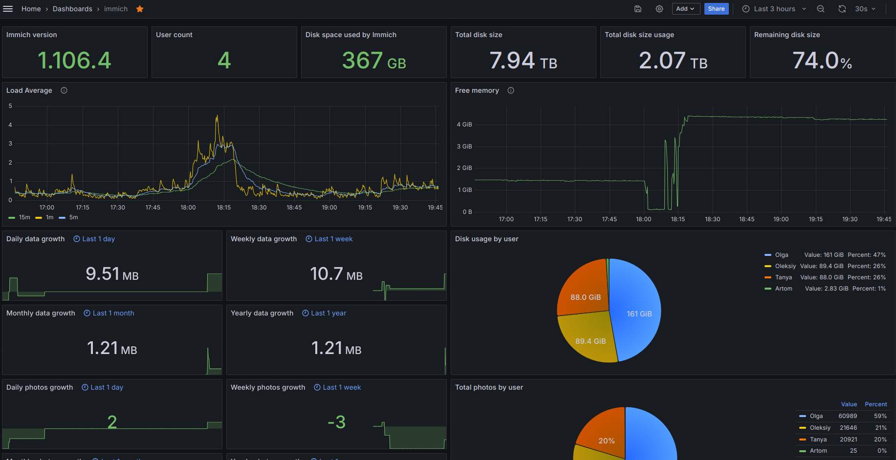

# This project has been retired in favor of [ImmichStat](https://github.com/friendlyFriend4000/ImmichStat)


## Prometheus Immich exporter
[More info](./grafana/README.md)
A prometheus exporter for Immich. Get metrics from a server and offers them in a prometheus format.


## How to use it

Here is an example docker run command

```
docker run -e IMMICH_PORT=8080 -e IMMICH_HOST=192.168.178.1 -e IMMICH_API_TOKEN=YOUR_TOKEN_HERE -p 8000:8000 friendlyfriend/prometheus-immich-exporter
```
Or you can add the following to your immich docker-compose.yaml
```
  immich-exporter:
    image: friendlyfriend/prometheus-immich-exporter
    container_name: immich_exporter
    environment:
      - IMMICH_PORT=2283
      - IMMICH_HOST=immich-server
      - IMMICH_API_TOKEN=<TOKEN>
    ports:
      - 8000:8000
    restart: unless-stopped
```

Add this to your prometheus.yml
```
  - job_name: "immich_exporter"
    static_configs:
        - targets: ['yourimmichexporter:port']
```
In case if you run prometheus from the same docker-compose you can use this job
```
  - job_name: immich_exporter
    static_configs:
        - targets: ['immich-exporter:8000']
```
The application reads configuration using environment variables:

| Environment variable | Default  | Description                                        |
|----------------------|----------|----------------------------------------------------|
| `IMMICH_HOST`        |          | Immich proxy url                                   |
| `IMMICH_PORT`        | `8080`   | Immich proxy port                                  |
| `IMMICH_API_TOKEN`   |          | Immich API token, created from Immich dashboard    |
| `EXPORTER_PORT`      | `8000`   | Exporter listening port                            |
| `EXPORTER_LOG_LEVEL` | `INFO`   | Log level. One of: `DEBUG`, `INFO`, `WARNING`, `ERROR`, `CRITICAL` |
| `METRICS_PREFIX`     | `immich` | Prefix to add to all the metrics                   |


## Metrics

These are the metrics this program exports, assuming the `METRICS_PREFIX` is `immich`:


| `metric name`                            | `description`                                                             |
|------------------------------------------|---------------------------------------------------------------------------|
| `immich_server_info_version_number`      | `pings server and passes version number with the use of labels={version}` |
| `immich_server_info_diskAvailable`       | `available space on disk`                                                 |
| `immich_server_info_totalDiskSize`       | `total disk size`                                                         |
| `immich_server_info_diskUse`             | `disk space used by your system`                                          |
| `immich_server_info_diskUsagePercentage` | `same as above but in percentage`                                         |

| `metric name`                         | `description`                               |
|---------------------------------------|---------------------------------------------|
| `immich_server_stats_user_count`      | `number of users signed up `                |
| `immich_server_stats_photos_by_users` | `array of users and their amount of photos` |
| `immich_server_stats_photos_growth`   | `sum of photos of all users`                |
| `immich_server_stats_videos_by_users` | `array of users and their amount of videos` |
| `immich_server_stats_videos_growth`   | `sum of all videos of all users`            |
| `immich_server_stats_usage_by_users`  | `the disk space each user uses`             |
| `immich_server_stats_usage_growth`    | `sum of disk space taken up by all users`   |

| `metric name`                         | `description`                                                          |
|---------------------------------------|------------------------------------------------------------------------|
| `immich_system_info_loadAverage`      | `array of load average (1m, 5m 15m)`                                   |
| `immich_system_info_memory`           | `array of memory states (Total, Available, Percent, Used, Free)`       |
| `immich_system_cpu_usage`             | `Representing the current system-wide CPU utilization as a percentage` |


## Screenshot



[More info](./grafana/README.md)

## License

This software is released under the [GPLv3 license](LICENSE).
